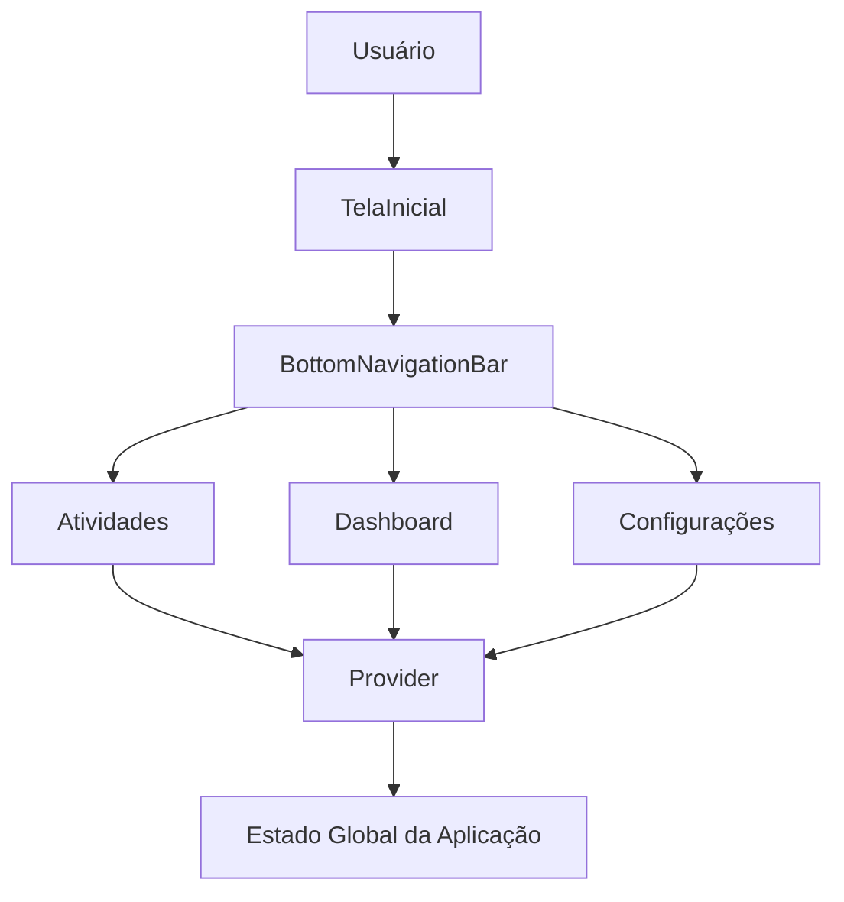
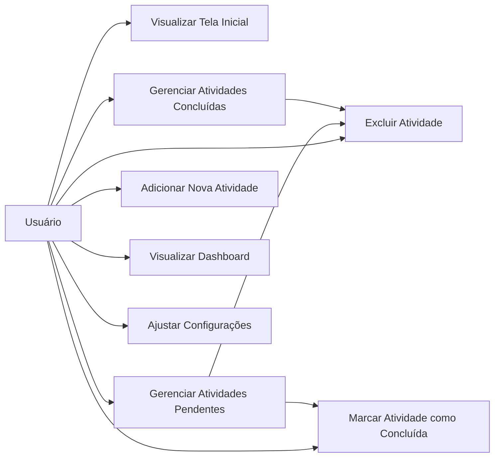
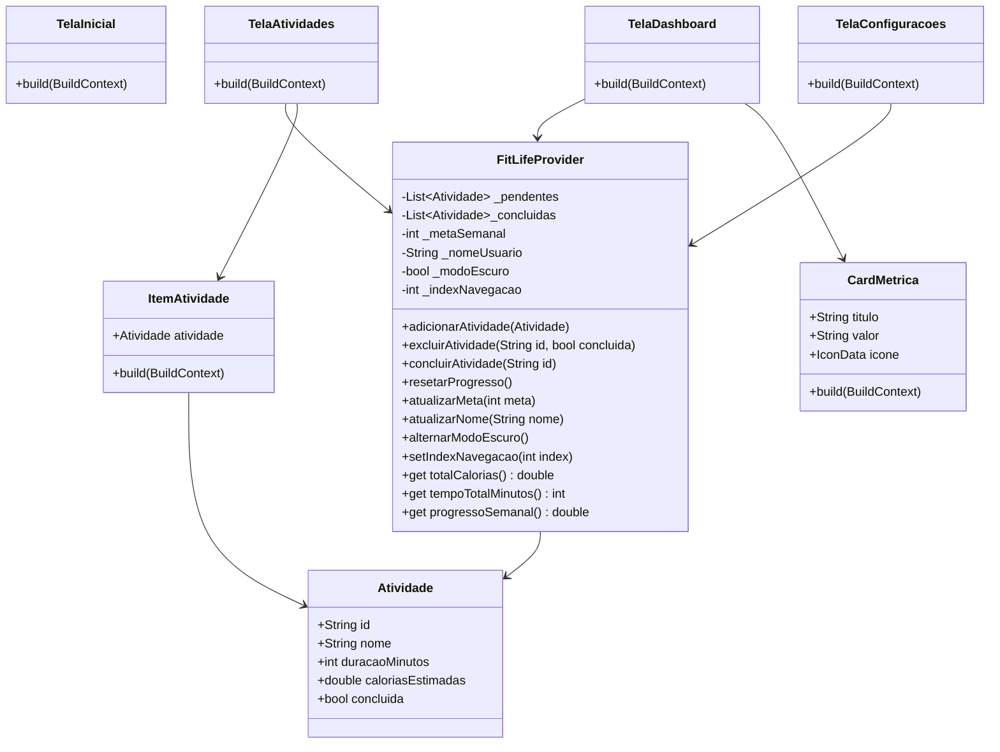
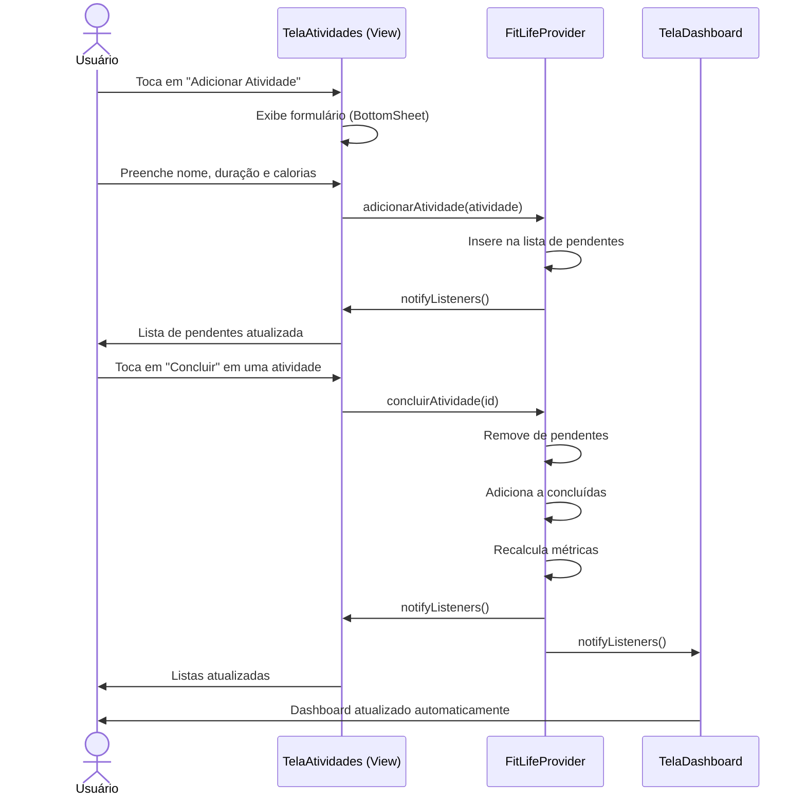
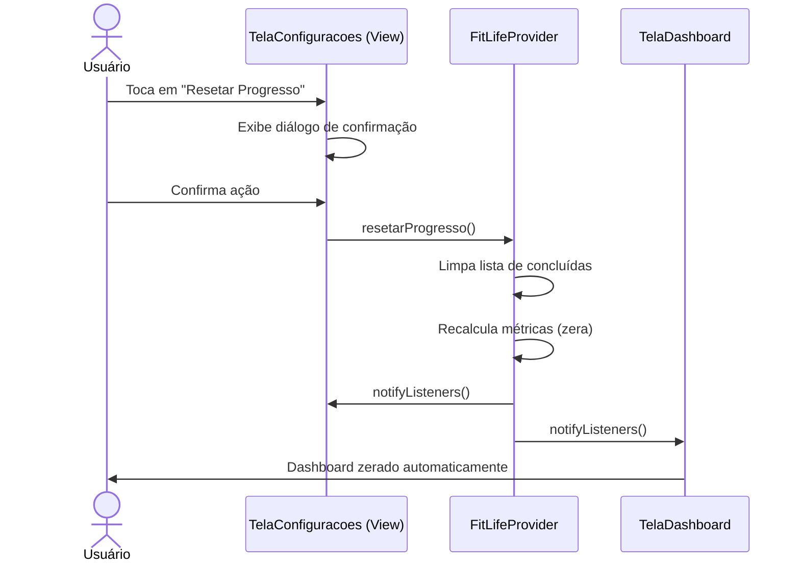
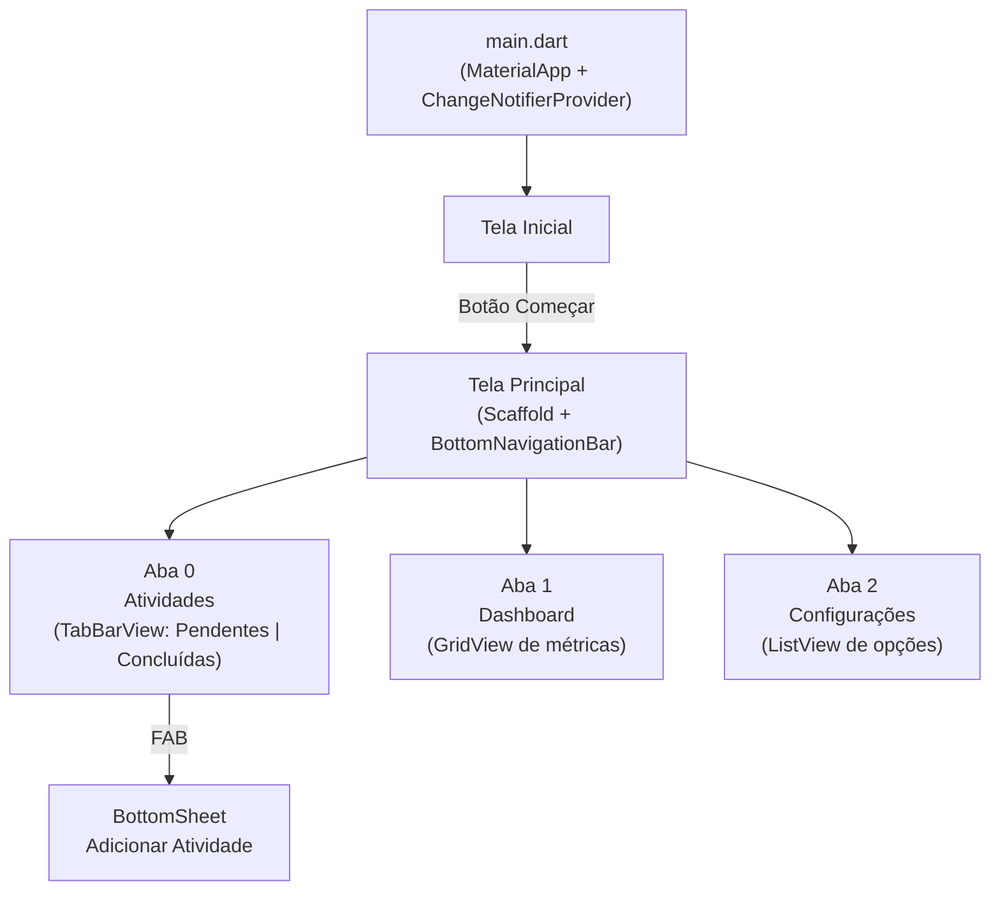

# Documentação de Especificação de Requisitos de Software (SRS)

## FitLife – Aplicativo de Monitoramento de Saúde e Atividades Físicas

**Padrão Internacional:** ISO/IEC/IEEE 29148:2018
**Versão:** 1.0.0
**Data:** 2026-04-30
**Autor:** LorenzoPradalMalosso

---

## 1. Introdução

### 1.1 Propósito

Este documento descreve os requisitos do sistema **FitLife**, com objetivo de:

* Definir funcionalidades da aplicação mobile
* Padronizar entendimento entre stakeholders
* Servir como base para desenvolvimento e testes
* Orientar a implementação da arquitetura com Provider

---

### 1.2 Escopo

O sistema permitirá:

* Apresentação do aplicativo ao usuário na tela inicial
* Registro e gerenciamento de atividades físicas (pendentes e concluídas)
* Adição e exclusão de atividades personalizadas
* Visualização de métricas e indicadores no dashboard fitness
* Configuração de preferências do usuário

O sistema será uma aplicação **mobile** desenvolvida com:

* **Flutter** (framework principal)
* **Provider** (gerenciamento de estado)
* **BottomNavigationBar** (navegação principal)
* **Arquitetura em camadas** (separação de responsabilidades)

---

### 1.3 Definições

| Termo | Definição |
|---|---|
| Atividade | Exercício físico registrado pelo usuário |
| Pendente | Atividade ainda não realizada |
| Concluída | Atividade marcada como realizada |
| Meta Semanal | Número alvo de atividades definido pelo usuário |
| Progresso | Percentual de atividades concluídas em relação à meta |
| Calorias | Estimativa calórica calculada com base nas atividades concluídas |
| Tempo de Treino | Soma do tempo estimado das atividades concluídas |

Lista de Acrônimos:

* **SRS** – Software Requirements Specification
* **RF** – Requisito Funcional
* **RNF** – Requisito Não-Funcional
* **RN** – Regra de Negócio
* **UC** – Use Case (Caso de Uso)
* **SGF** – Sistema de Gestão Fitness

---

### 1.4 Visão Geral do Documento

Este documento está organizado em:

* Introdução e visão geral
* Descrição geral do sistema
* Requisitos funcionais e não funcionais detalhados
* Modelos UML
* Regras de negócio
* Análise de risco
* Controle de versão

---

## 2. Descrição Geral do Sistema

### 2.1 Perspectiva do Sistema

O sistema é uma aplicação mobile standalone, operada em dispositivos Android e iOS via Flutter.



---

### 2.2 Funções do Sistema

O sistema deve:

* Apresentar o aplicativo ao usuário na tela inicial
* Listar atividades físicas pendentes e concluídas
* Permitir adicionar novas atividades personalizadas
* Permitir excluir atividades existentes
* Marcar atividades como concluídas
* Exibir métricas e indicadores no dashboard
* Permitir configurar preferências do usuário
* Gerenciar o estado global com Provider

---

### 2.3 Classes de Usuários

| Usuário | Descrição |
|---|---|
| Usuário Final | Pessoa que utiliza o aplicativo para registrar e acompanhar suas atividades físicas |

---

### 2.4 Ambiente Operacional

* Dispositivos Android (API 21+)
* Flutter SDK (versão estável mais recente)

---

### 2.5 Restrições

* Não utiliza banco de dados externo
* Dados armazenados em memória (sem persistência entre sessões)
* Sem autenticação de usuário
* Sem integração com APIs externas

---

### 2.6 Suposições

* O usuário possui smartphone com sistema operacional Android
* O usuário possui conhecimentos básicos de operação de aplicativos mobile
* O volume de atividades cadastradas é de pequeno porte

---

## 3. Requisitos do Sistema

### 3.1 Requisitos Funcionais

---

#### RF-001: Tela Inicial

**Descrição:** Exibir tela de apresentação do aplicativo com acesso à funcionalidade principal.

* Prioridade: Alta
* Versão: 1.0
* Data: 2026-04-30
* Rastreabilidade: Necessidade do Stakeholder 001

**Critérios de Aceitação:**

- [ ] Exibir nome do aplicativo (FitLife)
- [ ] Exibir slogan do aplicativo
- [ ] Exibir imagem ou ilustração fitness
- [ ] Exibir botão "Começar" que navega para a tela principal
- [ ] Sem simulação de login

---

#### RF-002: Listagem de Atividades Pendentes

**Descrição:** Exibir lista de atividades físicas ainda não realizadas pelo usuário.

* Prioridade: Alta
* Versão: 1.0
* Data: 2026-04-30
* Rastreabilidade: Necessidade do Stakeholder 002

**Critérios de Aceitação:**

- [ ] Exibir lista (ListView) com atividades pendentes
- [ ] Cada item deve exibir: nome da atividade, duração estimada e calorias estimadas
- [ ] Cada item deve conter botão para marcar como concluída
- [ ] Cada item deve conter botão para excluir a atividade
- [ ] Estado atualizado via Provider

---

#### RF-003: Listagem de Atividades Concluídas

**Descrição:** Exibir lista de atividades físicas marcadas como realizadas.

* Prioridade: Alta
* Versão: 1.0
* Data: 2026-04-30
* Rastreabilidade: Necessidade do Stakeholder 003

**Critérios de Aceitação:**

- [ ] Exibir lista (ListView) com atividades concluídas
- [ ] Cada item deve exibir: nome da atividade, duração e calorias
- [ ] Cada item deve conter botão para excluir da lista de concluídas
- [ ] Estado atualizado via Provider

---

#### RF-004: Adição de Nova Atividade

**Descrição:** Permitir que o usuário cadastre novas atividades físicas personalizadas.

* Prioridade: Alta
* Versão: 1.0
* Data: 2026-04-30
* Rastreabilidade: Necessidade do Stakeholder 004

**Critérios de Aceitação:**

- [ ] Botão de adição visível na tela de Atividades
- [ ] Formulário com campos: Nome, Duração (min) e Calorias estimadas
- [ ] Validação de campos obrigatórios
- [ ] Atividade adicionada à lista de pendentes
- [ ] Estado atualizado via Provider
- [ ] Notificação de sucesso ao usuário

---

#### RF-005: Exclusão de Atividade

**Descrição:** Permitir que o usuário exclua atividades das listas de pendentes ou concluídas.

* Prioridade: Alta
* Versão: 1.0
* Data: 2026-04-30
* Rastreabilidade: Necessidade do Stakeholder 005

**Critérios de Aceitação:**

- [ ] Botão de exclusão disponível em cada item de atividade
- [ ] Confirmação antes de excluir (dialog ou swipe)
- [ ] Atividade removida da lista correspondente
- [ ] Estado atualizado via Provider

---

#### RF-006: Marcar Atividade como Concluída

**Descrição:** Permitir que o usuário mova uma atividade de pendente para concluída.

* Prioridade: Alta
* Versão: 1.0
* Data: 2026-04-30
* Rastreabilidade: Necessidade do Stakeholder 006

**Critérios de Aceitação:**

- [ ] Botão de conclusão disponível em cada item de atividade pendente
- [ ] Atividade removida da lista de pendentes
- [ ] Atividade adicionada à lista de concluídas
- [ ] Métricas do dashboard atualizadas automaticamente
- [ ] Estado atualizado via Provider

---

#### RF-007: Dashboard Fitness

**Descrição:** Exibir painel com resumo das métricas e indicadores de desempenho do usuário.

* Prioridade: Alta
* Versão: 1.0
* Data: 2026-04-30
* Rastreabilidade: Necessidade do Stakeholder 007

**Critérios de Aceitação:**

- [ ] Exibir quantidade de atividades pendentes
- [ ] Exibir quantidade de atividades realizadas
- [ ] Exibir meta semanal configurada
- [ ] Exibir percentual de progresso semanal (atividades concluídas / meta × 100)
- [ ] Exibir total de calorias gastas (soma das atividades concluídas)
- [ ] Exibir tempo total de treino (soma das durações das atividades concluídas)
- [ ] Layout em GridView com cards de métricas
- [ ] Atualização automática via Provider

---

#### RF-008: Tela de Configurações

**Descrição:** Permitir ao usuário ajustar preferências e parâmetros da aplicação.

* Prioridade: Média
* Versão: 1.0
* Data: 2026-04-30
* Rastreabilidade: Necessidade do Stakeholder 008

**Critérios de Aceitação:**

- [ ] Toggle para ativação/desativação do modo escuro
- [ ] Campo para alteração do nome do usuário
- [ ] Campo para definição da meta semanal (número inteiro positivo)
- [ ] Botão para resetar progresso (limpar atividades concluídas)
- [ ] Todas as alterações refletidas em tempo real via Provider

---

#### RF-009: Navegação Principal

**Descrição:** Prover navegação fluida entre as telas principais via BottomNavigationBar.

* Prioridade: Alta
* Versão: 1.0
* Data: 2026-04-30
* Rastreabilidade: Necessidade do Stakeholder 009

**Critérios de Aceitação:**

- [ ] BottomNavigationBar com 3 abas: Atividades, Dashboard, Configurações
- [ ] Navegação controlada via Provider (índice da aba selecionada)
- [ ] Aba ativa destacada visualmente
- [ ] Transição fluida entre telas

---

### 3.2 Requisitos Não Funcionais

#### RNF-001: Usabilidade
**Descrição:** Interface simples, intuitiva e responsiva, adequada ao contexto mobile.

#### RNF-002: Desempenho
**Descrição:** Respostas e transições inferiores a 300ms; atualização de estado imediata via Provider.

#### RNF-003: Arquitetura
**Descrição:** Separação de responsabilidades com Provider para gerenciamento de estado; widgets reutilizáveis e código comentado nos pontos principais.

#### RNF-004: Confiabilidade
**Descrição:** Validação obrigatória de entradas de dados; tratamento de erros nas operações críticas.

#### RNF-005: Responsividade
**Descrição:** Layout adaptável a diferentes tamanhos de tela (smartphones de 4" a 7").

#### RNF-006: Manutenibilidade
**Descrição:** Código organizado, nomenclatura padronizada e separação clara entre Model, View e lógica de Provider.

---

## 4. Regras de Negócio

| Regra | Descrição |
|---|---|
| RN-001 | Quantidade de atividades concluídas não pode ser negativa |
| RN-002 | A meta semanal deve ser um número inteiro positivo (mínimo: 1) |
| RN-003 | Nome do usuário é obrigatório e não pode estar em branco |
| RN-004 | Uma atividade só pode ser concluída se estiver na lista de pendentes |
| RN-005 | O progresso semanal é calculado como: (concluídas / meta) × 100, limitado a 100% |
| RN-006 | Calorias e tempo total são recalculados automaticamente ao concluir ou excluir atividades |
| RN-007 | O reset de progresso limpa apenas as atividades concluídas, mantendo as pendentes |
| RN-008 | Nome da atividade é obrigatório para o cadastro |
| RN-009 | Duração e calorias estimadas devem ser valores positivos |

---

## 5. Modelos do Sistema

### 5.1 Diagrama de Casos de Uso



---

### 5.2 Diagrama de Classes



---

### 5.3 Diagrama de Sequência

#### 5.3.1 Adicionar e Concluir Atividade



#### 5.3.2 Resetar Progresso via Configurações



---

### 5.4 Diagrama de Navegação



---

## 6. Estrutura de Pastas do Projeto

```
FitLife/
│
├── lib/
│   ├── main.dart                    # Ponto de entrada, configuração do Provider e tema
│   │
│   ├── providers/
│   │   └── FitLife_provider.dart   # Provider principal (estado global)
│   │
│   ├── screens/
│   │   ├── tela_inicial.dart        # RF-001: Tela de apresentação
│   │   ├── tela_principal.dart      # RF-009: Scaffold + BottomNavigationBar
│   │   ├── tela_atividades.dart     # RF-002, RF-003, RF-004, RF-005, RF-006
│   │   ├── tela_dashboard.dart      # RF-007: Dashboard com métricas
│   │   └── tela_configuracoes.dart  # RF-008: Configurações do usuário
│   │
│   └── widgets/
│       ├── card_metrica.dart        # Widget reutilizável para cards do dashboard
│       ├── item_atividade.dart      # Widget reutilizável para itens das listas
│       └── form_atividade.dart      # Widget do formulário de nova atividade
│
├── pubspec.yaml                     # Dependências do projeto (provider, etc.)
└── README.md                        # Este documento
```

---

## 7. Análise de Risco

### 7.1 Matriz de Análise de Risco

| Risco | Impacto | Probabilidade | Mitigação |
|---|---|---|---|
| Perda de dados ao fechar o app | Alto | Alta | Implementar persistência futura com shared_preferences |
| Estado dessincronizado entre telas | Alto | Média | Uso correto do Provider com notifyListeners() |
| Entrada de dados inválida | Médio | Média | Validação obrigatória nos formulários |
| Layout quebrado em telas pequenas | Médio | Baixa | Testes em múltiplos tamanhos com MediaQuery |
| Cálculo incorreto de progresso | Médio | Baixa | Lógica centralizada no Provider com testes unitários |

---

## 8. Prototipagem

### 8.1 Link de prototipagem do projeto

Link Figma: https://www.figma.com/design/FFCwifwoRgBoErs8oAYZRb/Untitled?node-id=0-1&t=2ACyJKgscs2mAv3Z-1

---

## 9. Controle de Versão

### 9.1 Histórico de Alterações

| Versão | Data | Autor | Modificação |
|---|---|---|---|
| 1.0.0 | 2026-04-30 | LorenzoPradalMalosso | Versão Inicial |

---

### 9.2 Aprovações

| Papel | Nome | Data | Assinatura |
|---|---|---|---|
| Stakeholder | — | — | [ ] |
| Desenvolvedor | LorenzoPradalMalosso | 2026-04-30 | [ ] |

---
